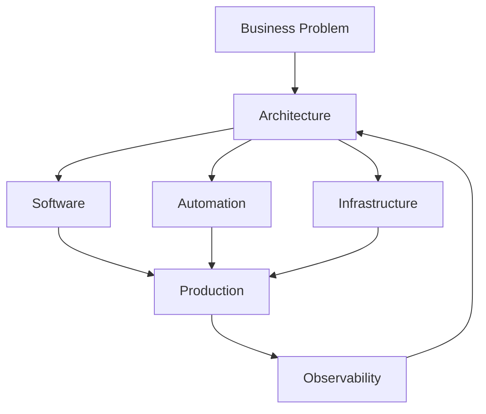

<div align="center">

# <span style="color:#39FF14">STACK</span>BLAZADA

### **Engineering the digital layer of your business.**

<br>

[](https://stackblazada.com.br)
[](https://github.com/StackBlazada)

</div>

---

## `> whoami`

**StackBlazada** é uma empresa de tecnologia focada em construir soluções digitais que realmente entram em operação.

Não fazemos apenas código.

Construímos **sistemas, produtos, automações e infraestrutura** para transformar ideias em operações funcionais, escaláveis e mensuráveis.

```text
IDEIA
  │
  ├── WEB
  ├── SOFTWARE
  ├── AUTOMAÇÃO
  ├── IA
  ├── INFRAESTRUTURA
  └── DEVOPS
        │
        ▼
     OPERAÇÃO
```

---

## `> what_we_build`

<table>
<tr>
<td width="50%">

### 🌐 Web & Software

Aplicações web, APIs, sistemas internos, plataformas e produtos digitais.

</td>
<td width="50%">

### ⚙️ Automação

Processos automatizados para reduzir trabalho manual e aumentar eficiência operacional.

</td>
</tr>

<tr>
<td>

### ☁️ Infraestrutura

Ambientes, servidores, containers, redes e arquiteturas preparadas para produção.

</td>
<td>

### 🚀 DevOps

CI/CD, observabilidade, deployment e automação da infraestrutura.

</td>
</tr>

<tr>
<td>

### 🧠 Inteligência Artificial

Integração de IA em produtos, processos e operações empresariais.

</td>
<td>

### 🔐 Engenharia & Segurança

Arquiteturas pensadas para confiabilidade, manutenção e crescimento.

</td>
</tr>
</table>

---

## `> our_stack`

Tecnologia é ferramenta.

A escolha depende do problema.

```text
Frontend
├── React
├── Next.js
├── TypeScript
└── Tailwind

Backend
├── Node.js
├── Python
├── APIs REST
└── PostgreSQL

Infrastructure
├── Linux
├── Docker
├── Git
├── CI/CD
└── Cloud

Automation
├── APIs
├── Webhooks
├── Workers
└── AI / LLMs
```

> A StackBlazada não é definida por uma linguagem.
> **É definida pelo problema que conseguimos resolver.**

---

## `> engineering_philosophy`

### **Build. Automate. Scale.**

Nós acreditamos em sistemas simples de entender, fáceis de manter e preparados para evoluir.

**01 — Entender**

Antes de escrever código, entendemos o problema.

**02 — Construir**

Transformamos requisitos em software funcional.

**03 — Automatizar**

Tudo que pode ser automatizado deve ser questionado.

**04 — Operar**

Software não termina no `git push`.

Ele precisa funcionar em produção.

**05 — Evoluir**

Monitoramos, corrigimos, melhoramos e escalamos.

---

## `> architecture`



---

## `> open_source`

Parte do nosso conhecimento nasce e retorna para a comunidade.

Aqui você encontrará projetos, ferramentas, experimentos e componentes desenvolvidos pela StackBlazada.

Nem tudo que construímos é público.

Mas aquilo que pode ser compartilhado, **será**.

---

## `> repositories`

Nossos repositórios normalmente se dividem em:

| Categoria | Propósito |
|---|---|
| `products` | Produtos e aplicações |
| `services` | APIs e serviços |
| `automation` | Automações e integrações |
| `infrastructure` | Infraestrutura e DevOps |
| `libraries` | Bibliotecas reutilizáveis |
| `experiments` | Pesquisa e experimentação |
| `internal` | Ferramentas internas |

---

## `> standards`

```text
✓ Código legível
✓ Documentação clara
✓ Commits organizados
✓ Automação sempre que possível
✓ Segurança desde o início
✓ Infraestrutura reproduzível
✓ Testes onde fazem sentido
✓ Observabilidade em produção
```

---

## `> philosophy`

> **"Da ideia à operação."**

Uma ideia não vale muito se nunca chega ao mundo real.

Por isso, nosso trabalho não termina quando o software funciona localmente.

Ele termina quando a solução está **operando, entregando valor e preparada para crescer.**

---

<div align="center">

### STACKBLAZADA

**WEB · SOFTWARE · AUTOMAÇÃO · INFRA · DEVOPS · IA**

<br>

```text
BUILD SOMETHING THAT WORKS.
THEN MAKE IT BETTER.
```

<br>

<sub>Technology • Automation • Software</sub>

</div>
