

<picture>
  <source media="(prefers-color-scheme: dark)" srcset="https://readme-typing-svg.demolab.com?font=JetBrains+Mono&weight=600&size=20&duration=2800&pause=900&color=E5E7EB&center=true&vCenter=true&width=700&lines=Technology+%26+Software+Engineering;Web+%7C+Cloud+%7C+IA+%7C+Automa%C3%A7%C3%A3o;Constru%C3%A7%C3%A3o+e+opera%C3%A7%C3%A3o+de+solu%C3%A7%C3%B5es+digitais">
  
</picture>

  

 

  

  

---

<h2 align="center">⚡ Sobre a StackBlazada</h2>

A <b>StackBlazada</b> é uma empresa de tecnologia focada em <b>construir e operar soluções digitais completas</b>.
  
Do primeiro desenho de arquitetura ao software em produção. 
Do processo manual ao workflow automatizado. 
Da infraestrutura ao produto final.

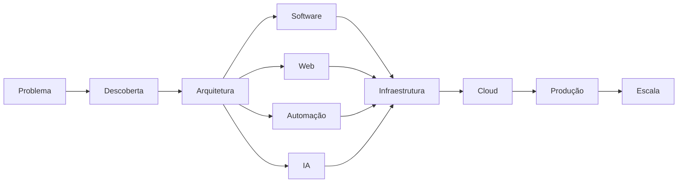

<b><i>Não entregamos apenas tecnologia. Construímos a operação que existe por trás dela.</i></b>

---

<h2 align="center">🧩 O que fazemos</h2>

<table align="center">
<tr>
<td align="center" valign="top" width="33%">

<h3 align="center">🌐 Web</h3>

Aplicações e experiências digitais completas.

<code>Landing Pages</code> <code>Websites</code> <code>Dashboards</code> <code>Portais</code> <code>SaaS</code> <code>E-commerce</code> <code>Sistemas Web</code> <code>APIs</code>

</td>
<td align="center" valign="top" width="33%">

<h3 align="center">📱 Aplicações</h3>

Produtos digitais para diferentes plataformas.

<code>Web Apps</code> <code>Mobile</code> <code>PWA</code> <code>Desktop</code> <code>SaaS</code> <code>Aplicações internas</code> <code>Painéis administrativos</code>

</td>
<td align="center" valign="top" width="33%">

<h3 align="center">⚙️ Automação</h3>

Processos conectados e executados automaticamente.

<code>n8n</code> <code>Workflows</code> <code>Webhooks</code> <code>APIs</code> <code>RPA</code> <code>Jobs</code> <code>Integrações</code> <code>Event-driven</code>

</td>
</tr>
<tr>
<td align="center" valign="top">

<h3 align="center">🧠 Inteligência Artificial</h3>

IA aplicada a produtos e operações.

<code>LLMs</code> <code>AI Agents</code> <code>RAG</code> <code>Chatbots</code> <code>Vision</code> <code>Document AI</code> <code>Classificação</code> <code>Automação inteligente</code>

</td>
<td align="center" valign="top">

<h3 align="center">☁️ Cloud & Infra</h3>

Infraestrutura preparada para produção.

<code>Linux</code> <code>Docker</code> <code>Cloud</code> <code>Servers</code> <code>Networking</code> <code>DNS</code> <code>Storage</code> <code>Load Balancing</code>

</td>
<td align="center" valign="top">

<h3 align="center">🚀 DevOps</h3>

Do commit ao ambiente de produção.

<code>CI/CD</code> <code>Git</code> <code>Containers</code> <code>Deploy</code> <code>Monitoring</code> <code>Logging</code> <code>Observability</code> <code>IaC</code>

</td>
</tr>
<tr>
<td align="center" valign="top">

<h3 align="center">🗄️ Dados</h3>

Dados confiáveis para aplicações e decisões.

<code>PostgreSQL</code> <code>MySQL</code> <code>Redis</code> <code>ETL</code> <code>Data Pipelines</code> <code>Backup</code> <code>Optimization</code> <code>Analytics</code>

</td>
<td align="center" valign="top">

<h3 align="center">🔐 Segurança</h3>

Segurança integrada à engenharia.

<code>Authentication</code> <code>Authorization</code> <code>API Security</code> <code>Hardening</code> <code>Secrets</code> <code>Encryption</code> <code>OWASP</code> <code>Auditing</code>

</td>
<td align="center" valign="top">

<h3 align="center">🔌 Integrações</h3>

Conectamos sistemas que precisam conversar.

<code>ERP</code> <code>CRM</code> <code>E-commerce</code> <code>Payment</code> <code>WhatsApp</code> <code>Email</code> <code>APIs</code> <code>Legacy Systems</code>

</td>
</tr>
<tr>
<td align="center" valign="top">

<h3 align="center">🏢 Sistemas Empresariais</h3>

Software para operações reais.

<code>ERP</code> <code>CRM</code> <code>Financeiro</code> <code>Estoque</code> <code>RH</code> <code>Atendimento</code> <code>Dashboards</code> <code>Backoffice</code>

</td>
<td align="center" valign="top">

<h3 align="center">📊 Dados & Analytics</h3>

Transformamos dados em informação útil.

<code>BI</code> <code>Dashboards</code> <code>Reports</code> <code>KPIs</code> <code>Data Processing</code> <code>ETL / ELT</code> <code>Analytics</code>

</td>
<td align="center" valign="top">

<h3 align="center">🧪 P&D</h3>

Experimentação e novas tecnologias.

<code>Prototypes</code> <code>Proof of Concept</code> <code>AI</code> <code>Open Source</code> <code>New Architectures</code> <code>Emerging Tech</code>

</td>
</tr>
</table>

---

<h2 align="center">🛠️ Stack Tecnológica</h2>

<table align="center">
<tr>
<td align="center"><b>Backend</b></td>
<td align="center">

</td>
</tr>
<tr>
<td align="center"><b>Frontend</b></td>
<td align="center">

</td>
</tr>
<tr>
<td align="center"><b>Automação & IA</b></td>
<td align="center">

</td>
</tr>
<tr>
<td align="center"><b>Dados</b></td>
<td align="center">

</td>
</tr>
<tr>
<td align="center"><b>Infra & DevOps</b></td>
<td align="center">

</td>
</tr>
<tr>
<td align="center"><b>Cloud</b></td>
<td align="center">

</td>
</tr>
<tr>
<td align="center"><b>Observabilidade</b></td>
<td align="center">

</td>
</tr>
</table>

---

<h2 align="center">⚙️ Automação</h2>

A automação é uma das partes centrais da StackBlazada. 
Utilizamos <b>n8n</b>, APIs, webhooks, workers, filas e código próprio para conectar processos e sistemas.

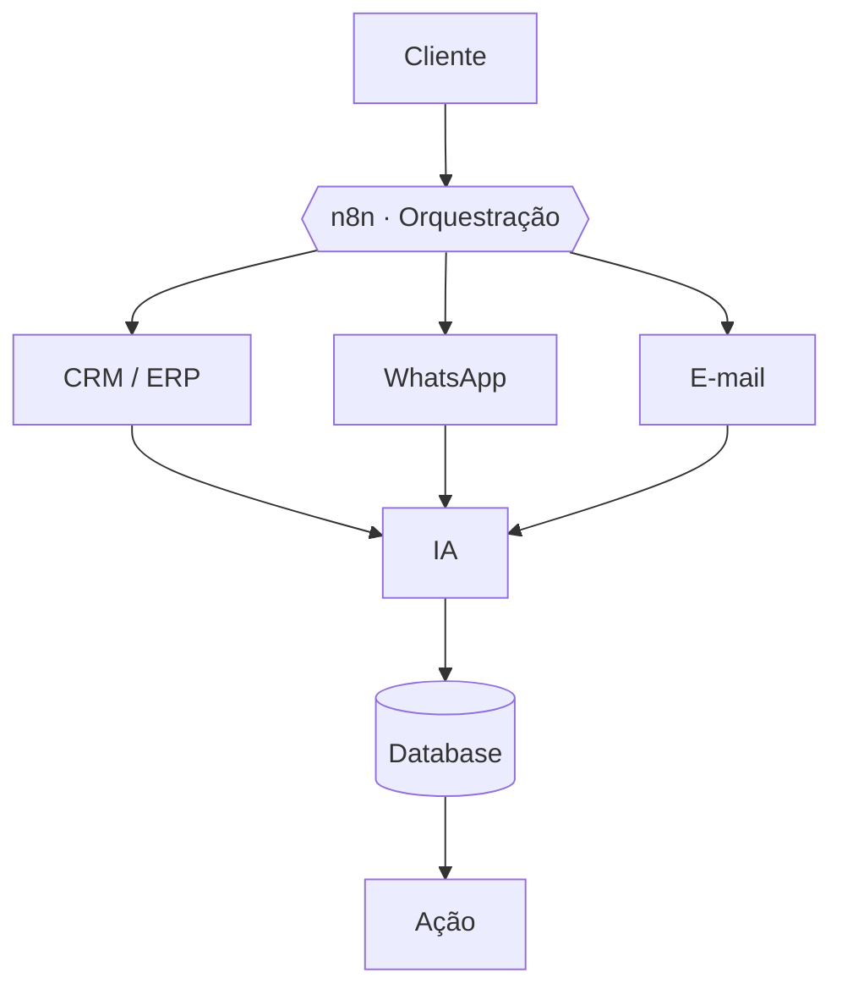

<b>Exemplos de fluxo</b>

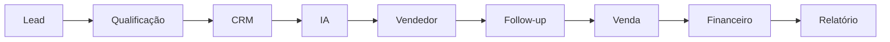

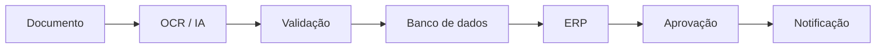

Ou simplesmente: <b>Evento → Workflow → Decisão → Ação</b>

---

<h2 align="center">🧠 Inteligência Artificial</h2>

Não tratamos IA como uma tecnologia isolada. 
Ela pode fazer parte do produto, da automação ou da operação.

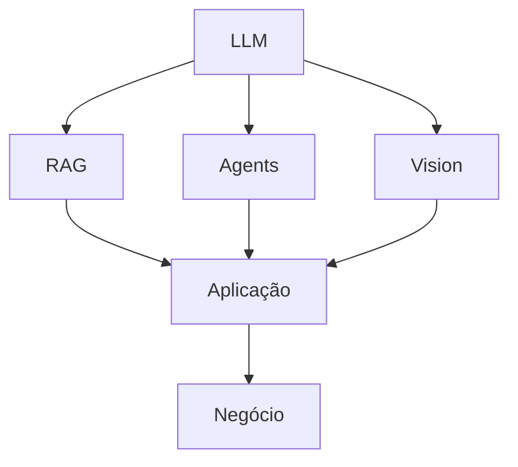

<b>Possibilidades</b>

<code>AI Agents</code> <code>RAG</code> <code>Chatbots</code> <code>Atendimento inteligente</code> <code>Classificação automática</code> <code>Extração de documentos</code> <code>Análise de dados</code> <code>Geração de conteúdo</code> <code>Copilots internos</code> <code>Processamento de linguagem</code> <code>Automação inteligente</code> <code>Integração com APIs de IA</code>

---

<h2 align="center">🏗️ Engenharia de Software</h2>

Trabalhamos com diferentes arquiteturas de acordo com o problema.

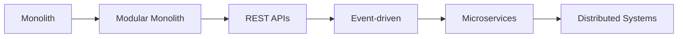

<b>Princípios</b>

<code>SOLID</code> <code>DDD</code> <code>Clean Architecture</code> <code>Clean Code</code> <code>Design Patterns</code> <code>Separation of Concerns</code> <code>API First</code> <code>Security First</code> <code>Observability</code> <code>Automation</code>

---

<h2 align="center">🐧 Linux Engineering</h2>

Nossa identidade também nasce de uma filosofia muito presente no ecossistema Linux:  
<b><i>Entender o sistema. Controlar o sistema. Automatizar o sistema.</i></b>

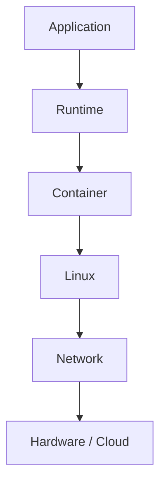

Não usamos Linux apenas porque "é Linux". 
Usamos porque <b>infraestrutura é parte do produto</b>.

---

<h2 align="center">🔐 Segurança</h2>

Segurança não é uma etapa adicionada no final. 
É uma preocupação desde a arquitetura.

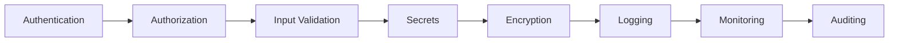

<code>OWASP</code> <code>API Security</code> <code>Identity</code> <code>Access Control</code> <code>Secrets</code> <code>Network Security</code> <code>Server Hardening</code> <code>Container Security</code> <code>Secure Development</code>

---

<h2 align="center">☁️ Cloud</h2>

Projetamos ambientes de acordo com a necessidade da aplicação.

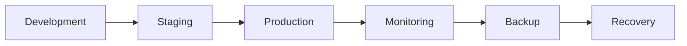

<code>Cloud Infrastructure</code> <code>VPS</code> <code>Containers</code> <code>Managed Services</code> <code>Object Storage</code> <code>Databases</code> <code>Reverse Proxy</code> <code>CDN</code> <code>DNS</code> <code>Load Balancing</code> <code>Monitoring</code> <code>Backup & Recovery</code>

---

<h2 align="center">🔌 Integrações</h2>

Sistemas precisam conversar. 
Nós construímos essa ponte.

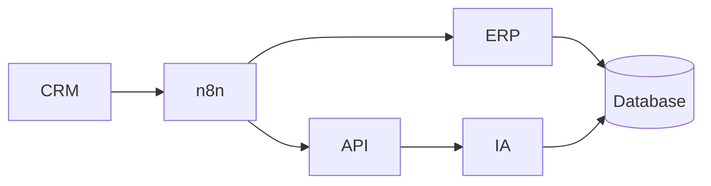

<code>ERPs</code> <code>CRMs</code> <code>E-commerce</code> <code>Gateways de pagamento</code> <code>WhatsApp</code> <code>E-mail</code> <code>APIs externas</code> <code>Sistemas legados</code> <code>Bancos de dados</code> <code>Serviços de IA</code> <code>Ferramentas internas</code>

---

<h2 align="center">📊 Observabilidade</h2>

Se não sabemos o que está acontecendo, não controlamos o sistema.

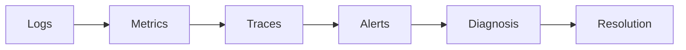

<code>Availability</code> <code>Latency</code> <code>Errors</code> <code>CPU</code> <code>Memory</code> <code>Storage</code> <code>Requests</code> <code>Jobs</code> <code>Workflows</code> <code>Database</code> <code>Infrastructure</code>

---

<h2 align="center">📦 Ecossistema</h2>

Os repositórios da organização são estruturados de acordo com sua finalidade.

<table align="center">
<tr>
<td>

<pre>
StackBlazada/
├── applications/      # produtos e aplicações finais
├── backend/           # APIs e serviços de backend
├── frontend/          # interfaces web
├── services/          # serviços e microsserviços
├── automation/        # automações e workers
├── n8n/               # workflows n8n
├── ai/                # agentes, RAG, LLMs
├── infrastructure/    # servidores, cloud, IaC
├── devops/            # CI/CD, deploy, monitoramento
├── integrations/      # conectores e integrações
├── libraries/         # bibliotecas reutilizáveis
├── tools/             # ferramentas internas
├── data/              # pipelines, ETL, analytics
└── experiments/       # P&D e provas de conceito
</pre>

</td>
</tr>
</table>

---

<h2 align="center">🧪 Research & Development</h2>

Tecnologia muda. Nós também. Mantemos espaço para experimentação com:

<code>Artificial Intelligence</code> <code>AI Agents</code> <code>LLMs</code> <code>Automation</code> <code>Distributed Systems</code> <code>Cloud</code> <code>Open Source</code> <code>Developer Tools</code> <code>New Architectures</code> <code>Emerging Technologies</code>

<i>Nem todo experimento vira produto. Mas todo experimento gera conhecimento.</i>

---

<h2 align="center">🌱 Open Source</h2>

Parte do conhecimento que construímos pode voltar para a comunidade.

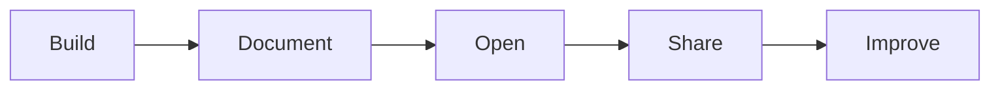

Projetos, bibliotecas, ferramentas e experimentos que possam ser compartilhados serão publicados aqui.

---

<h2 align="center">🧭 Nossa filosofia</h2>

<table align="center">
<tr>
<th align="center">#</th>
<th align="center">Princípio</th>
<th align="center">O que significa</th>
</tr>
<tr><td align="center">01</td><td align="center"><b>Understand</b></td><td align="center">Entender antes de construir.</td></tr>
<tr><td align="center">02</td><td align="center"><b>Design</b></td><td align="center">Arquitetar antes de complicar.</td></tr>
<tr><td align="center">03</td><td align="center"><b>Build</b></td><td align="center">Construir para o mundo real.</td></tr>
<tr><td align="center">04</td><td align="center"><b>Automate</b></td><td align="center">Automatizar o que não deveria ser manual.</td></tr>
<tr><td align="center">05</td><td align="center"><b>Integrate</b></td><td align="center">Fazer sistemas conversarem.</td></tr>
<tr><td align="center">06</td><td align="center"><b>Deploy</b></td><td align="center">Software precisa chegar à produção.</td></tr>
<tr><td align="center">07</td><td align="center"><b>Observe</b></td><td align="center">O que não é observado não pode ser melhorado.</td></tr>
<tr><td align="center">08</td><td align="center"><b>Scale</b></td><td align="center">Crescer sem perder controle.</td></tr>
</table>

---

<h2 align="center">⚡ O princípio</h2>

<h3 align="center">A tecnologia é o meio. A operação é o objetivo.</h3>

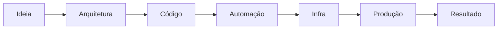

<b>BUILD SOMETHING THAT WORKS.</b> 
<b>AUTOMATE WHAT SHOULD NOT BE MANUAL.</b> 
<b>ENGINEER FOR WHAT COMES NEXT.</b>

 

  

StackBlazada · Technology & Software Engineering · <b>Da ideia à operação.</b>

