<div align="center">


<picture>
  <source media="(prefers-color-scheme: dark)" srcset="https://readme-typing-svg.demolab.com?font=JetBrains+Mono&weight=600&size=20&duration=2800&pause=900&color=E5E7EB&center=true&vCenter=true&width=700&lines=Technology+%26+Software+Engineering;Web+%7C+Cloud+%7C+IA+%7C+Automa%C3%A7%C3%A3o;Constru%C3%A7%C3%A3o+e+opera%C3%A7%C3%A3o+de+solu%C3%A7%C3%B5es+digitais">
  
</picture>

<br/><br/>


<br/>


<br/><br/>

<a href="https://stackblazada.com.br">
  
</a>
<a href="https://github.com/StackBlazada">
  
</a>

</div>

<br/>

## ⚡ Sobre a StackBlazada

A **StackBlazada** é uma empresa de tecnologia focada em **construir e operar soluções digitais completas**.

- Do primeiro desenho de arquitetura ao software em produção.
- Do processo manual ao workflow automatizado.
- Da infraestrutura ao produto final.

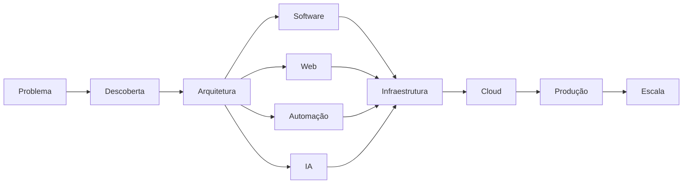

> **Não entregamos apenas tecnologia. Construímos a operação que existe por trás dela.**

---

## 🧩 O que fazemos

<table>
<tr>
<td valign="top" width="33%">

### 🌐 Web
Aplicações e experiências digitais completas.

`Landing Pages` `Websites` `Dashboards` `Portais` `SaaS` `E-commerce` `Sistemas Web` `APIs`

</td>
<td valign="top" width="33%">

### 📱 Aplicações
Produtos digitais para diferentes plataformas.

`Web Apps` `Mobile` `PWA` `Desktop` `SaaS` `Aplicações internas` `Painéis administrativos`

</td>
<td valign="top" width="33%">

### ⚙️ Automação
Processos conectados e executados automaticamente.

`n8n` `Workflows` `Webhooks` `APIs` `RPA` `Jobs` `Integrações` `Event-driven`

</td>
</tr>
<tr>
<td valign="top">

### 🧠 Inteligência Artificial
IA aplicada a produtos e operações.

`LLMs` `AI Agents` `RAG` `Chatbots` `Vision` `Document AI` `Classificação` `Automação inteligente`

</td>
<td valign="top">

### ☁️ Cloud & Infra
Infraestrutura preparada para produção.

`Linux` `Docker` `Cloud` `Servers` `Networking` `DNS` `Storage` `Load Balancing`

</td>
<td valign="top">

### 🚀 DevOps
Do commit ao ambiente de produção.

`CI/CD` `Git` `Containers` `Deploy` `Monitoring` `Logging` `Observability` `IaC`

</td>
</tr>
<tr>
<td valign="top">

### 🗄️ Dados
Dados confiáveis para aplicações e decisões.

`PostgreSQL` `MySQL` `Redis` `ETL` `Data Pipelines` `Backup` `Optimization` `Analytics`

</td>
<td valign="top">

### 🔐 Segurança
Segurança integrada à engenharia.

`Authentication` `Authorization` `API Security` `Hardening` `Secrets` `Encryption` `OWASP` `Auditing`

</td>
<td valign="top">

### 🔌 Integrações
Conectamos sistemas que precisam conversar.

`ERP` `CRM` `E-commerce` `Payment` `WhatsApp` `Email` `APIs` `Legacy Systems`

</td>
</tr>
<tr>
<td valign="top">

### 🏢 Sistemas Empresariais
Software para operações reais.

`ERP` `CRM` `Financeiro` `Estoque` `RH` `Atendimento` `Dashboards` `Backoffice`

</td>
<td valign="top">

### 📊 Dados & Analytics
Transformamos dados em informação útil.

`BI` `Dashboards` `Reports` `KPIs` `Data Processing` `ETL / ELT` `Analytics`

</td>
<td valign="top">

### 🧪 P&D
Experimentação e novas tecnologias.

`Prototypes` `Proof of Concept` `AI` `Open Source` `New Architectures` `Emerging Tech`

</td>
</tr>
</table>

---

## 🛠️ Stack Tecnológica

<table>
<tr>
<td width="18%"><b>Backend</b></td>
<td>

</td>
</tr>
<tr>
<td><b>Frontend</b></td>
<td>

</td>
</tr>
<tr>
<td><b>Automação & IA</b></td>
<td>


</td>
</tr>
<tr>
<td><b>Dados</b></td>
<td>

</td>
</tr>
<tr>
<td><b>Infra & DevOps</b></td>
<td>

</td>
</tr>
<tr>
<td><b>Cloud</b></td>
<td>

</td>
</tr>
<tr>
<td><b>Observabilidade</b></td>
<td>

</td>
</tr>
</table>

---

## ⚙️ Automação

A automação é uma das partes centrais da StackBlazada. Utilizamos **n8n**, APIs, webhooks, workers, filas e código próprio para conectar processos e sistemas.

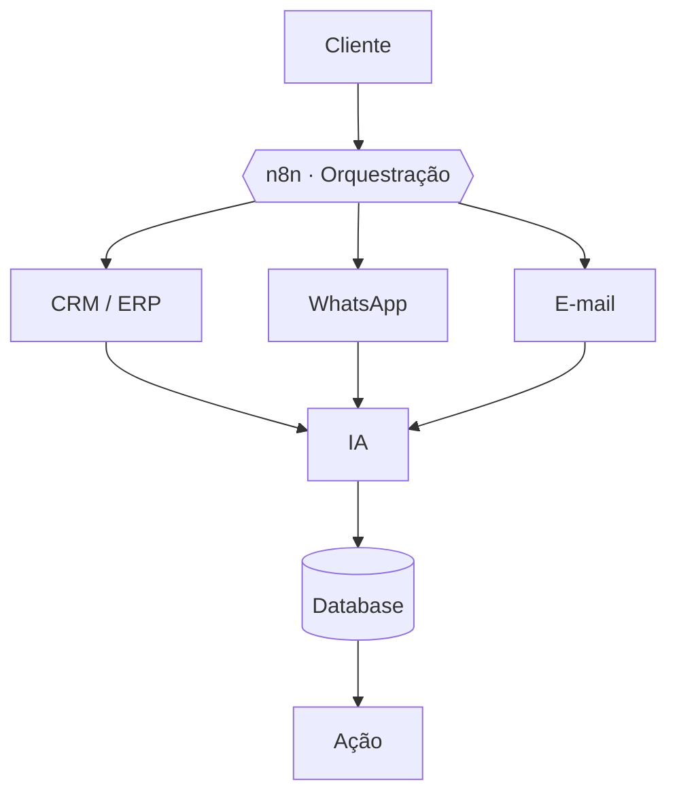

**Exemplos de fluxo**

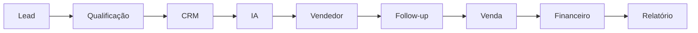

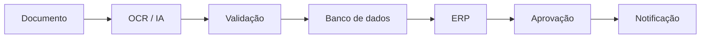

Ou simplesmente: **Evento → Workflow → Decisão → Ação**

---

## 🧠 Inteligência Artificial

Não tratamos IA como uma tecnologia isolada. Ela pode fazer parte do produto, da automação ou da operação.

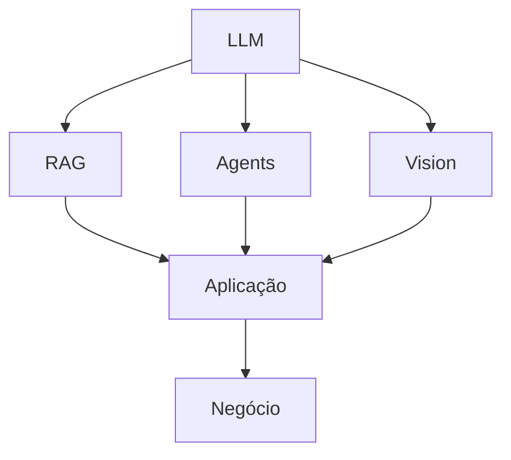

<table>
<tr>
<td valign="top" width="50%">

- AI Agents
- RAG
- Chatbots
- Atendimento inteligente
- Classificação automática
- Extração de documentos

</td>
<td valign="top" width="50%">

- Análise de dados
- Geração de conteúdo
- Copilots internos
- Processamento de linguagem
- Automação inteligente
- Integração com APIs de IA

</td>
</tr>
</table>

---

## 🏗️ Engenharia de Software

Trabalhamos com diferentes arquiteturas de acordo com o problema.

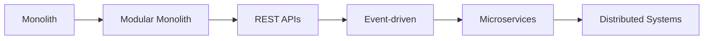

**Princípios**

`SOLID` `DDD` `Clean Architecture` `Clean Code` `Design Patterns` `Separation of Concerns` `API First` `Security First` `Observability` `Automation`

---

## 🐧 Linux Engineering

Nossa identidade também nasce de uma filosofia muito presente no ecossistema Linux:

> **Entender o sistema. Controlar o sistema. Automatizar o sistema.**

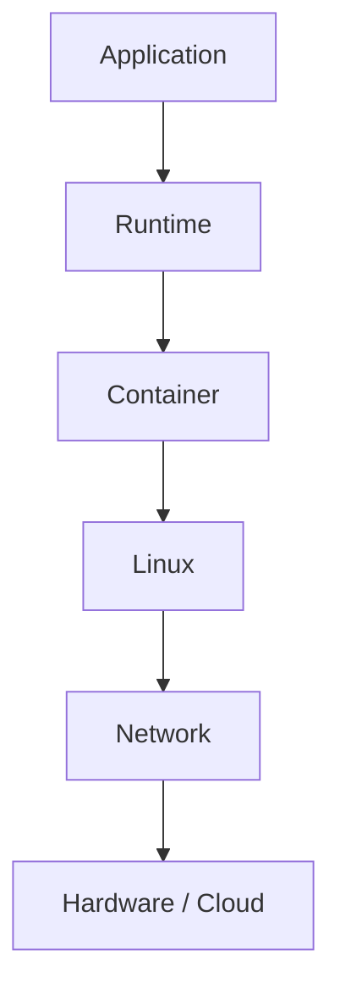

Não usamos Linux apenas porque "é Linux". Usamos porque **infraestrutura é parte do produto**.

---

## 🔐 Segurança

Segurança não é uma etapa adicionada no final. É uma preocupação desde a arquitetura.

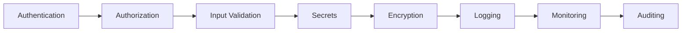

`OWASP` `API Security` `Identity` `Access Control` `Secrets` `Network Security` `Server Hardening` `Container Security` `Secure Development`

---

## ☁️ Cloud

Projetamos ambientes de acordo com a necessidade da aplicação.

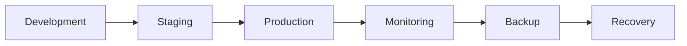

`Cloud Infrastructure` `VPS` `Containers` `Managed Services` `Object Storage` `Databases` `Reverse Proxy` `CDN` `DNS` `Load Balancing` `Monitoring` `Backup & Recovery`

---

## 🔌 Integrações

Sistemas precisam conversar. Nós construímos essa ponte.

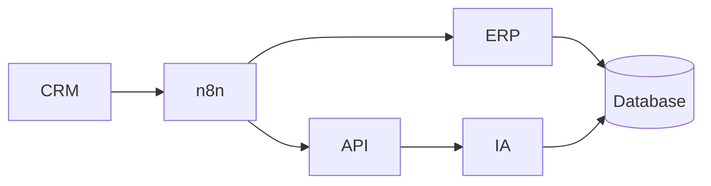

`ERPs` `CRMs` `E-commerce` `Gateways de pagamento` `WhatsApp` `E-mail` `APIs externas` `Sistemas legados` `Bancos de dados` `Serviços de IA` `Ferramentas internas`

---

## 📊 Observabilidade

Se não sabemos o que está acontecendo, não controlamos o sistema.

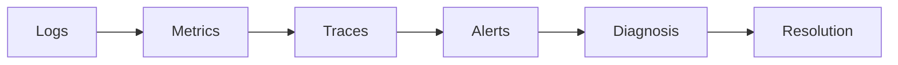

`Availability` `Latency` `Errors` `CPU` `Memory` `Storage` `Requests` `Jobs` `Workflows` `Database` `Infrastructure`

---

## 📦 Ecossistema

Os repositórios da organização são estruturados de acordo com sua finalidade.

```text
StackBlazada/
├── applications/      # produtos e aplicações finais
├── backend/           # APIs e serviços de backend
├── frontend/          # interfaces web
├── services/          # serviços e microsserviços
├── automation/        # automações e workers
├── n8n/               # workflows n8n
├── ai/                # agentes, RAG, LLMs
├── infrastructure/    # servidores, cloud, IaC
├── devops/            # CI/CD, deploy, monitoramento
├── integrations/      # conectores e integrações
├── libraries/         # bibliotecas reutilizáveis
├── tools/             # ferramentas internas
├── data/              # pipelines, ETL, analytics
└── experiments/       # P&D e provas de conceito
```

---

## 🧪 Research & Development

Tecnologia muda. Nós também. Mantemos espaço para experimentação com:

`Artificial Intelligence` `AI Agents` `LLMs` `Automation` `Distributed Systems` `Cloud` `Open Source` `Developer Tools` `New Architectures` `Emerging Technologies`

> Nem todo experimento vira produto. Mas todo experimento gera conhecimento.

---

## 🌱 Open Source

Parte do conhecimento que construímos pode voltar para a comunidade.

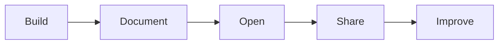

Projetos, bibliotecas, ferramentas e experimentos que possam ser compartilhados serão publicados aqui.

---

## 🧭 Nossa filosofia

| # | Princípio | O que significa |
|:-:|-----------|-----------------|
| 01 | **Understand** | Entender antes de construir. |
| 02 | **Design** | Arquitetar antes de complicar. |
| 03 | **Build** | Construir para o mundo real. |
| 04 | **Automate** | Automatizar o que não deveria ser manual. |
| 05 | **Integrate** | Fazer sistemas conversarem. |
| 06 | **Deploy** | Software precisa chegar à produção. |
| 07 | **Observe** | O que não é observado não pode ser melhorado. |
| 08 | **Scale** | Crescer sem perder controle. |

---

<div align="center">

### A tecnologia é o meio. A operação é o objetivo.

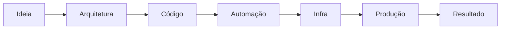

**BUILD SOMETHING THAT WORKS.**
**AUTOMATE WHAT SHOULD NOT BE MANUAL.**
**ENGINEER FOR WHAT COMES NEXT.**

<br/>

<a href="https://stackblazada.com.br">
  
</a>
<a href="https://github.com/StackBlazada">
  
</a>

<br/>

<sub>StackBlazada · Technology & Software Engineering · <b>Da ideia à operação.</b></sub>


</div>
